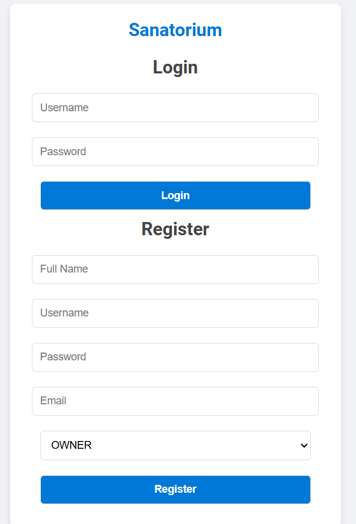
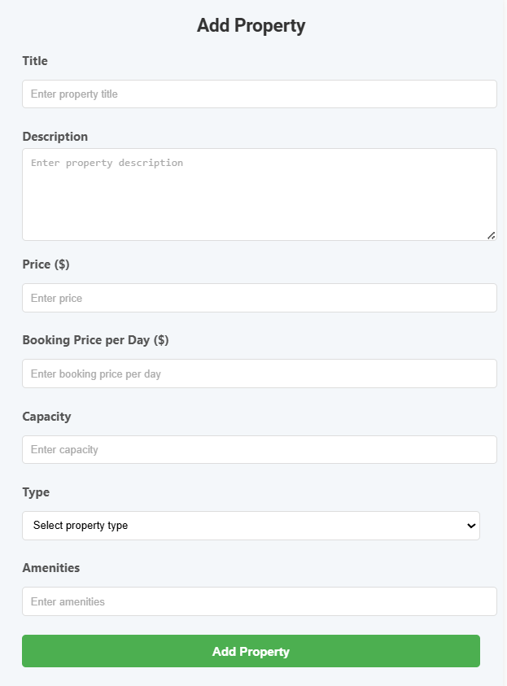
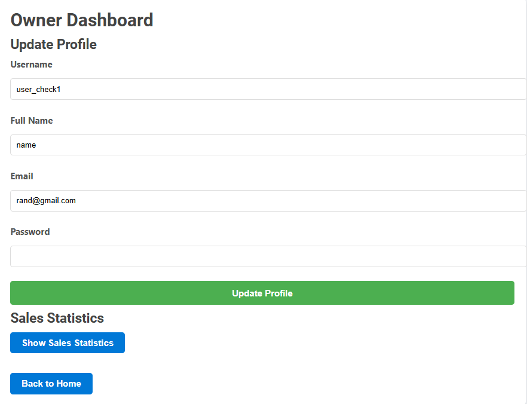
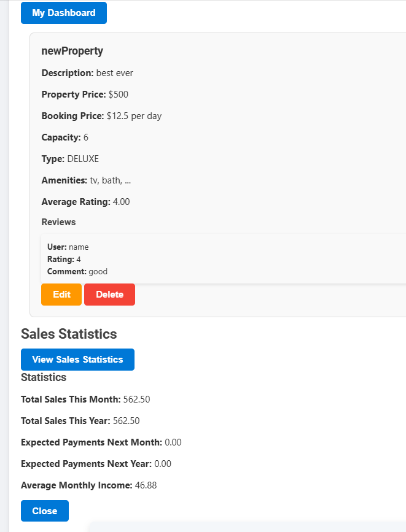
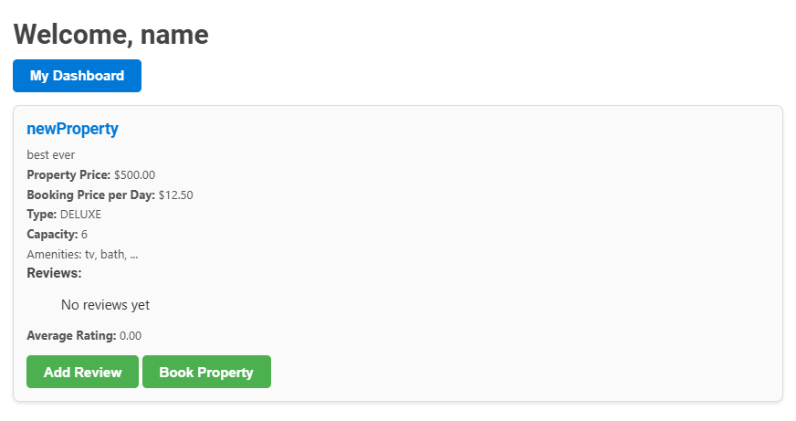
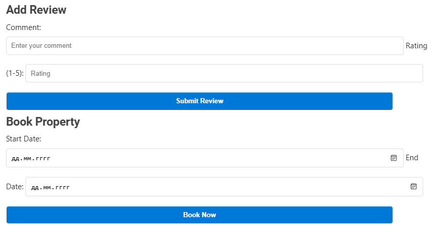

Платформа для санатория со следующим функционалом:
*	Просмотр свободных номеров с указанием цены, типа комнаты (стандарт, люкс), удобств.
*	Список доступных услуг (процедуры, развлечения, дополнительные сервисы).
*	Бронирование услуг и номеров: онлайн-бронирование с выбором услуг и номеров.
*	Сохранение корзины при перезагрузке клиентского приложения.
*	Личный кабинет пользователя: разделение ролей на арендодателя и арендатора. Первые могут выставлять объявления, просматривать статистику по продажам: сумма продаж за месяц, год, ожидаемые платежи, расчет продаж на следующий месяц.  Изменение данных об объектах: фото, описание, стоимость, прочая информация. Для арендаторов можно смотреть даты платежей, ранее уплаченные суммы, даты выезда с объектов. Возможность выставлять рейтинг обоим классам для оценки целесообразности сотрудничества.

Примеры работы:

Окно для регистрации и логина \.

Создание обьявления собственности \.

Личный кабинет - изменение собственных данных \.

Созданная собственность с отзывами и статистикой \.

Кабинет покупателя \.

Создание отзывов и бронирование \.
